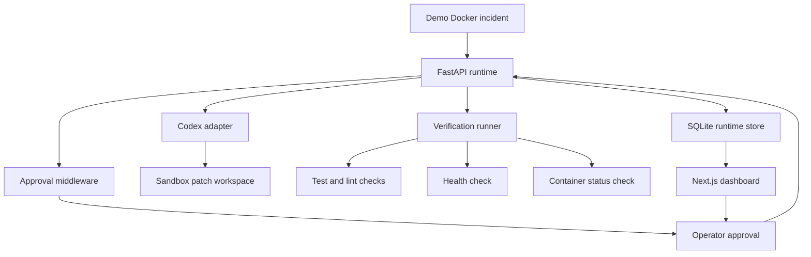

# Harness Runtime MVP Architecture

## Runtime Boundaries

- The runtime owns incident intake, task orchestration, approval state,
  verification, report persistence, and observability endpoints.
- The Codex adapter is constrained by command allowlists and sandbox path
  validation. Patch application happens in a temporary sandbox copy.
- Approval middleware blocks medium and high risk tasks until an operator
  approves them.
- Verification combines tests, lint, health checks, and container-state checks.
- The dashboard reads persisted traces, incidents, reports, approvals, and
  metrics from the FastAPI API.

## Golden Workflow

1. `POST /incidents/demo-docker` records a deterministic Docker health incident.
2. The runtime starts a Codex remediation task for the incident.
3. Middleware classifies the task as medium risk and pauses for approval.
4. `POST /approvals/{task_id}` records the operator decision.
5. Approved tasks resume automatically.
6. The Codex adapter proposes and applies a patch in a sandbox workspace.
7. Verification runs tests, lint, service health, and container status checks.
8. The report, trace graph, incident status, and metrics are persisted.
